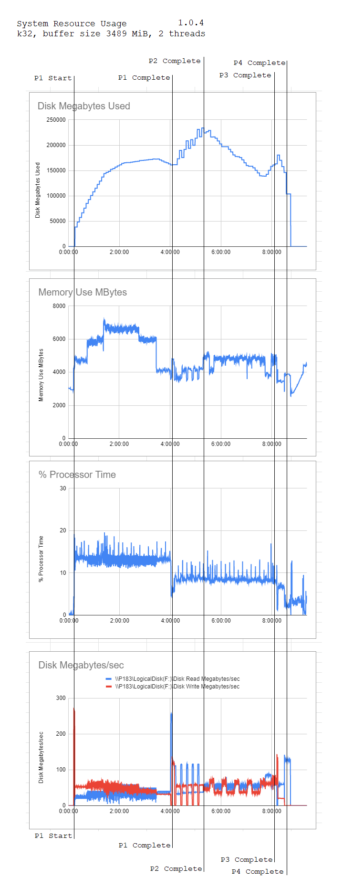

# Plotting

## Automatically moving plots

Move finished plots by rsync and appened if it was interrupted. Run by cron periodically:

```
* * * * * cd SOURCE_DIRECTORY && SCRIPT_BELOW
```
Script:

```
#!/bin/bash
PROCESSING="processing"
mkdir -p  "$PROCESSING"
PLOT=$(ls -1 *.plot | head -n1)
mv "$PLOT" "$PROCESSING"
rsync --append --progress -e 'ssh' "$PROCESSING/$PLOT" USER@HOST:TARGET_DIRECTORY && rm "$PROCESSING/$PLOT"
```

It never removes plot unless it was fully copied by rsync.

## Plotting phases


